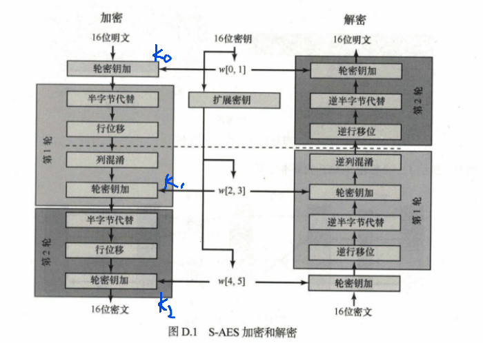
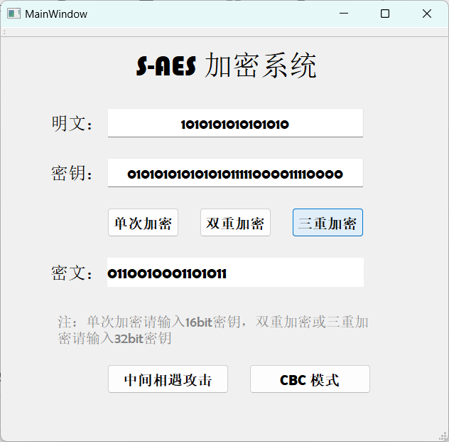

# S-AES 加密系统

## 项目介绍
本项目利用C++/Qt，根据S-AES算法编写和调试程序，提供GUI解密支持用户交互。输入可以是16bit的数据和16bit的密钥，输出是16bit的密文。加密算法使用4个不同的函数或变换：密钥加（Ax）、半字节代替（NS）、行移位（SR）和列混淆（MC）。
 

## 代码结构
项目代码结构按如下组织：
```
S-AES/
├── src/
│   ├── attack.cpp
│   ├── cbcmodel.cpp
│   └── mainwindow.cpp
├── include/
│   ├── attack.h
│   ├── cbcmodel.h
│   └── mainwindow.h
└── README.md
```

---

## 第1关：基本测试

#### 项目内容与特性
- **简单加密**：使用S-AES算法对16位明文进行单块加密。
- **简单解密**：使用相同的S-AES算法对加密后的密文进行解密，验证正确性。

#### 运行界面说明

1. **明文输入框**：输入16位二进制形式的明文。
2. **密钥输入框**：输入16位二进制密钥。
3. **密文显示框**：显示加密后的密文。
4. **加密按钮**：触发加密操作。
5. **解密按钮**：执行解密操作。
6. **解密后的明文显示框**：显示解密后的明文。

#### 功能演示
 

---

## 第2关：交叉测试

#### 项目内容与特性
- **算法一致性测试**：确保不同组编写的S-AES算法实现可以互操作。
- **跨组加解密**：测试A组加密的密文能否被B组正确解密，反之亦然。

#### 运行界面说明

1. **明文输入框**：输入16位二进制形式的明文。
2. **密钥输入框**：输入16位二进制密钥。
3. **密文显示框**：显示加密后的密文。
4. **加密按钮**：触发加密操作。
5. **解密按钮**：执行解密操作。
6. **解密后的明文显示框**：显示解密后的明文。

#### 功能演示

两组用户（A组和B组）各自输入相同的明文和密钥，系统会：
1. 各自对输入的明文进行S-AES加密。
2. 显示各自加密后的密文。

 


---

## 第3关：扩展功能

#### 项目内容与特性
- **ASCII编码支持**：加密算法的数据输入可以是ASCII编码字符串（分组为2 Bytes），对应地输出也可以是ACII字符串。
- **用户友好性**：解决明文和密文适应实际应用中的格式问题。

#### 运行界面说明

1. **明文输入框**：输入ASCII编码的明文。
2. **密钥输入框**：输入16位二进制密钥。
3. **密文显示框**：显示加密后的密文。
4. **加密按钮**：触发加密操作。
5. **解密按钮**：执行解密操作。
6. **解密后的明文显示框**：显示解密后的明文。

#### 功能演示

用户输入ASCII编码的明文和密钥后，系统会：
1. 将输入的ASCII编码明文转换为二进制形式。
2. 使用S-AES算法逐块加密明文。
3. 显示加密后的密文（可能是乱码）。

 

---

## 第4关：多重加密

#### 项目内容与功能演示
- **双重加密**：将S-AES算法通过双重加密进行扩展，分组长度仍然是16 bits，但密钥长度为32 bits。
   
- **三重加密**：采用32 bits密钥的模式进行三重加密解密。
  
  
- **中间相遇攻击**：利用已知的明文和密文对，尝试破解双重加密密钥。
   

---

## 第5关：工作模式基于 S-AES 算法的 CBC 加密与篡改密文实验

本关展示如何使用基于 **S-AES 算法**的 **密码分组链接 (CBC)** 模式对较长的明文消息进行加密与解密，并探索密文篡改对解密结果的影响。程序随机生成一个 16 位的二进制初始向量 (IV)，在 CBC 模式下将超过 16 位的密文进行分组加密，同时演示如何在解密时正确处理密文篡改。

 <!-- 示例图片路径，请替换为实际图片链接 -->


### 项目内容与特性

- **CBC 模式加密**：基于 S-AES 算法，分块加密长明文，适应超出单块的明文输入。
- **初始向量 (IV) 生成**：随机生成 16 位二进制的 IV 并显示，确保加解密双方共享。
- **篡改密文实验**：用户可以模拟篡改密文分组，观察篡改前后解密结果的不同，分析 CBC 模式的错误传播特性。


### 功能演示

#### 1. CBC 加密流程
用户输入明文、密钥后，系统会：
1. 随机生成并显示 **16 位 IV**。
2. 按 CBC 模式逐块加密明文，将加密结果作为密文显示。


#### 2. CBC 解密流程
在解密页面中，用户可以输入密文、密钥和 IV。
1. 系统按 CBC 模式逐块解密密文。
2. 显示还原的明文结果。

 <!-- 示例图片路径，请替换为实际图片链接 -->

### 3. 篡改密文实验
用户可以通过点击按钮篡改密文分组，并查看解密后的变化。

 <!-- 示例图片路径，请替换为实际图片链接 -->


### 运行界面说明

#### 必备控件

1. **明文输入框**：用户输入二进制形式的明文，适应超过 16 位的长输入。
2. **密钥输入框**：输入 16 位的二进制密钥。
3. **IV 显示框**：随机生成 16 位的 IV，便于加解密双方共享。
4. **密文显示框**：显示加密后的分组密文。
5. **加密按钮**：触发 CBC 加密流程。
6. **解密按钮**：执行 CBC 解密流程。
7. **篡改密文按钮**：模拟密文篡改，测试解密结果的差异。
8. **解密后的明文显示框**：显示解密后的原始明文或篡改后的结果。

---

## 项目结果分析

- **正常解密**：使用正确的密钥和 IV，可以恢复出原始明文。
- **篡改后的解密**：修改密文后，解密结果产生明显错误，体现 CBC 模式的错误传播特性。
