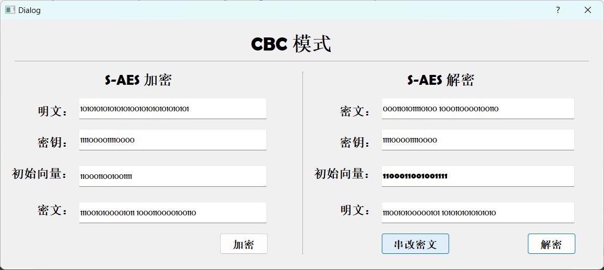

# S-AES

# 第5关：工作模式基于 S-AES 算法的 CBC 加密与篡改密文实验

本关展示如何使用基于 **S-AES 算法**的 **密码分组链接 (CBC)** 模式对较长的明文消息进行加密与解密，并探索密文篡改对解密结果的影响。程序随机生成一个 16 位的二进制初始向量 (IV)，在 CBC 模式下将超过 16 位的密文进行分组加密，同时演示如何在解密时正确处理密文篡改。

 <!-- 示例图片路径，请替换为实际图片链接 -->

---

## 项目内容与特性

- **CBC 模式加密**：基于 S-AES 算法，分块加密长明文，适应超出单块的明文输入。
- **初始向量 (IV) 生成**：随机生成 16 位二进制的 IV 并显示，确保加解密双方共享。
- **篡改密文实验**：用户可以模拟篡改密文分组，观察篡改前后解密结果的不同，分析 CBC 模式的错误传播特性。

---

## 功能演示

### 1. CBC 加密流程
用户输入明文、密钥后，系统会：
1. 随机生成并显示 **16 位 IV**。
2. 按 CBC 模式逐块加密明文，将加密结果作为密文显示。

### 2. CBC 解密流程
在解密页面中，用户可以输入密文、密钥和 IV。
1. 系统按 CBC 模式逐块解密密文。
2. 显示还原的明文结果。

 <!-- 示例图片路径，请替换为实际图片链接 -->

### 3. 篡改密文实验
用户可以通过点击按钮篡改密文分组，并查看解密后的变化。

 <!-- 示例图片路径，请替换为实际图片链接 -->

---

## 运行界面说明

### 必备控件

1. **明文输入框**：用户输入二进制形式的明文，适应超过 16 位的长输入。
2. **密钥输入框**：输入 16 位的二进制密钥。
3. **IV 显示框**：随机生成 16 位的 IV，便于加解密双方共享。
4. **密文显示框**：显示加密后的分组密文。
5. **加密按钮**：触发 CBC 加密流程。
6. **解密按钮**：执行 CBC 解密流程。
7. **篡改密文按钮**：模拟密文篡改，测试解密结果的差异。
8. **解密后的明文显示框**：显示解密后的原始明文或篡改后的结果。

---

## 项目结果分析

- **正常解密**：使用正确的密钥和 IV，可以恢复出原始明文。
- **篡改后的解密**：修改密文后，解密结果产生明显错误，体现 CBC 模式的错误传播特性。
